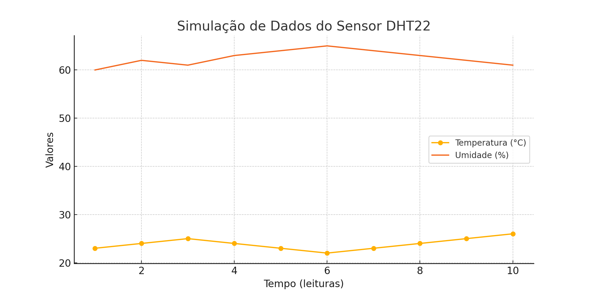

# 🚀 Sprint 2 – Simulação de Coleta de Dados com ESP32  

Este projeto representa a **segunda entrega** do desafio em parceria com a empresa **Hermes Reply**, focado na **simulação de coleta de dados em ambientes industriais digitais** utilizando o microcontrolador **ESP32** e sensores virtuais.

🔗 **Sprint 1 (Proposta Teórica)**: [Clique aqui](https://github.com/Amand95/Enterprise-Challenge---Sprint-1-)

---

## 🧠 Contexto

A coleta de dados em ambientes industriais modernos é essencial para a predição de falhas e automação. Com a Indústria 4.0, sensores embarcados conectados a dispositivos como o ESP32 permitem o monitoramento em tempo real de variáveis como temperatura, vibração e luminosidade. Nesta fase, simulamos esse cenário em ambiente virtual, com foco na leitura, visualização e análise de dados sensoriais.

---

## 🔌 Circuito Simulado

- **Plataforma de simulação:** [Wokwi](https://wokwi.com/projects/433657543736341505)
- **Microcontrolador:** ESP32
- **Sensor utilizado:** DHT22 (Temperatura e Umidade)

### 🎯 Justificativa da Escolha

O **DHT22** foi escolhido por ser amplamente usado em aplicações industriais para monitorar **temperatura e umidade**, dois fatores críticos para manutenção de equipamentos, segurança operacional e eficiência energética.

📷 **Imagem da simulação do circuito no Wokwi**  


---

## 📊 Análise de Dados



> **Insight:** Durante a simulação, a temperatura variou entre **23 °C** e **26 °C**, enquanto a umidade flutuou entre **60 %** e **65 %**, demonstrando estabilidade dentro de uma faixa esperada para um ambiente industrial controlado.

--- 

## 💻 Código-Fonte

### 📂 Local do Código
O código está disponível na pasta `/code` com nome `sensor_dht22.ino`.

--- 

Projeto: Sprint 2 – Simulação de Coleta de Dados com ESP32

Integrantes:

- Amanda da Silva Barros  – RM 564759
- Bruno Gambarini  – RM 561517
- Karina Jesus dos Santos – RM 559268
- Lucas Fagundes - RM 565179


Link do repositório: https://github.com/Amand95/Enterprise-Challenge---Sprint-2

### 📌 Trecho Representativo

```cpp
#include "DHT.h"

#define DHTPIN 15
#define DHTTYPE DHT22

DHT dht(DHTPIN, DHTTYPE);

void setup() {
  Serial.begin(9600);
  dht.begin();
}

void loop() {
  float temp = dht.readTemperature();
  float umid = dht.readHumidity();

  Serial.print("Temperatura: ");
  Serial.print(temp);
  Serial.print(" °C | Umidade: ");
  Serial.print(umid);
  Serial.println(" %");

  delay(2000);
}

