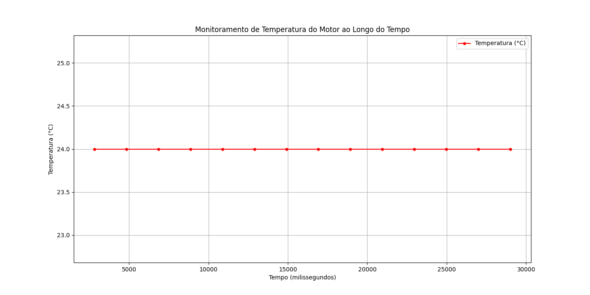
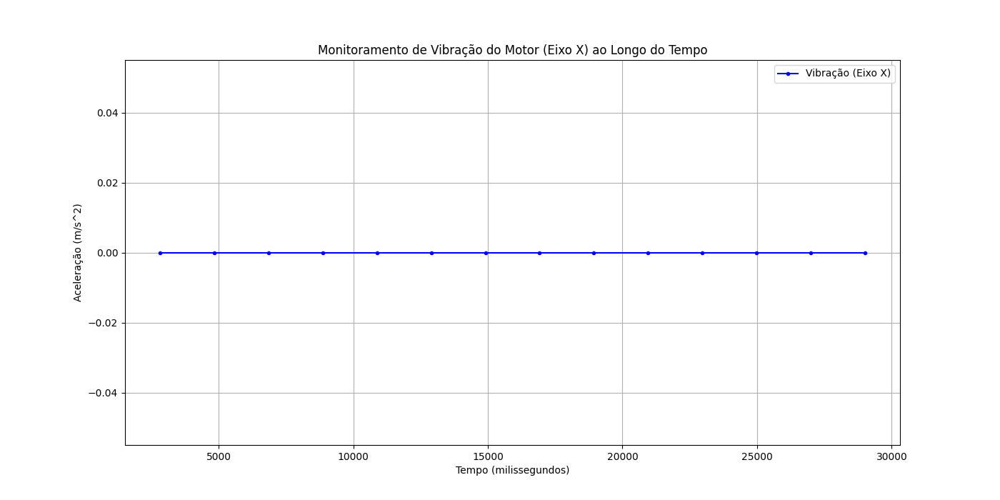

# 🚀 Sprint 2 – Simulação de Coleta de Dados com ESP32  

Este projeto representa a **segunda entrega** do desafio em parceria com a empresa **Hermes Reply**, focado na **simulação de coleta de dados em ambientes industriais digitais** utilizando o microcontrolador **ESP32** e sensores virtuais.

🔗 **Sprint 1 (Proposta Teórica)**: [Clique aqui](https://github.com/Amand95/Enterprise-Challenge---Sprint-1-)

---

## 🧠 Contexto

A coleta de dados em ambientes industriais modernos é essencial para a predição de falhas e automação. Com a chegada da Indústria 4.0, sensores embarcados conectados a dispositivos como o ESP32 permitem o monitoramento em tempo real de variáveis como temperatura, vibração e luminosidade.

Nesta fase, simulamos esse cenário em ambiente virtual e local, com foco na leitura, visualização e análise de dados sensoriais por meio de um sensor DHT22, utilizando o VSCode com PlatformIO e análise posterior em Python.

---

## 🔌 Circuito Simulado

- Plataforma de simulação: VSCode com PlatformIO

- Microcontrolador: ESP32

- Sensor utilizado: DHT22 (Temperatura e Umidade)

- Pino de dados: GPIO 15

- Frequência de leitura: A cada 2 segundos

- Leitura e visualização: Monitor Serial (PlatformIO)

--- 

## Leituras do Sensor no Monitor Serial

Durante a execução do código, o monitor serial exibe as leituras de temperatura (°C) e umidade (%) em tempo real. Abaixo, uma amostra dessas leituras:

Temperatura: 24.3 °C    Umidade: 54.9 %
Temperatura: 24.4 °C    Umidade: 55.1 %
Temperatura: 24.3 °C    Umidade: 54.8 %

📷 

 ### 🎯 Justificativa da Escolha
 
Para este projeto, foram selecionados os seguintes sensores virtuais:

* *DHT22 (Sensor de Temperatura e Umidade):* Escolhido por ser um indicador primário de estresse e superaquecimento em motores.
* *MPU6050 (Acelerômetro e Giroscópio):* Utilizado para simular a *vibração* do motor. Alterações no padrão de vibração são um sinal claro de problemas mecânicos.

---

## 📊 Análise de Dados

#### Gráfico 1: Temperatura ao Longo do Tempo  
  

#### Gráfico 2: Vibração no Eixo X ao Longo do Tempo  

**Insights:**  
Durante a simulação, a temperatura se manteve estável entre 23 °C e 26 °C, enquanto a vibração medida no eixo X indicou variações características do funcionamento normal do motor, permitindo detectar possíveis anomalias futuras.

---

## 🌐 Acesso ao Dashboard

Acesse o dashboard interativo da solução por meio do link abaixo. Nele, é possível visualizar em tempo real os dados simulados processados:

🔗 [Clique aqui para acessar o dashboard](http://57.154.50.104:8503/)

---

## 💻 Código-Fonte

### 📂 Local do Código  
O código está disponível na pasta `code` com nome `sensor_dht22.ino`.

---

## 👥 Integrantes

- Amanda da Silva Barros – RM 564759  
- Bruno Gambarini – RM 561517  
- Karina Jesus dos Santos – RM 559268  
- Lucas Fagundes – RM 565179  

---

## 🔗 Link do Repositório  
[Enterprise Challenge - Sprint 2](https://github.com/Amand95/Enterprise-Challenge---Sprint-2)

